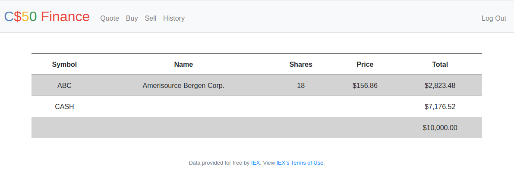

# Flask-Portfolio

This project was a Harvard`s CS50 course assignment.

Using python, HTML, CSS and a SQL database to store IEX API and user info, this application offers a portfolio.

## Sections:
**register**: It allows a user to register for an account via a form.

**quote**: It allows a user to look up a stock’s current price.

**buy**: It enables a user to buy stocks.

**sell**: It enables a user to sell shares of a stock.

**index**: It displays an HTML table summarizing, for the user currently logged in, which stocks the user owns, the numbers of shares owned, the current price of each stock, and the total value of each holding (i.e., shares times price). Also display the user’s current cash balance along with a grand total (i.e., stocks' total value plus cash).

**history**: It displays an HTML table summarizing all of a user’s transactions ever, listing row by row each and every buy and every sell.

**check**: It checks whether a username is available.

## Configure:
By querying IEX, you`re able to check real stocks’ actual prices. But first, you’ll need to register for an API key in order to be able to query IEX’s data. To do so, follow these steps:

  - Visit [IEX](iexcloud.io/cloud-login#/register/.)
  
  - Select the “Individual” account type, then enter your email address and a password, and click “Create account”.
  
  - Once registered, scroll down to “Get started for free” and click “Select Start” to choose the free plan.
  
  - Once you’ve confirmed your account via a confirmation email, visit [IEX/Token](https://iexcloud.io/console/tokens).
  
  - Copy the key that appears under the Token column (it should begin with pk_).
  
  - In a terminal window execute: `$ export API_KEY=value`

> where value is that (pasted) value, without any space immediately before or after the =. You also may wish to paste that value in a text document somewhere, in case you need it again later.

> Looks like the IEX API access is restricted to paid subscribers. One has to upgrade to gain access...

## Run:
- First thing install Start [Python 3](https://www.python.org/downloads/).

- Then run the following commands in terminal to install other prerequisites:
  
  - `sudo apt install python3-pip`
  
  - `pip3 install -r requirements.txt`

- Before running the app, you need to introduce the application to your terminal by exporting the FLASK_APP environment variable:
  
  - Bash: `$ export FLASK_APP=application.py`
  
  - Fish: `$ set -x FLASK_APP application.py`
  
  - CMD: `> set FLASK_APP=application.py`
  
  - Powershell: `> $env:FLASK_APP = "application.py"`
- Finally, running the application:
  - `flask run`
